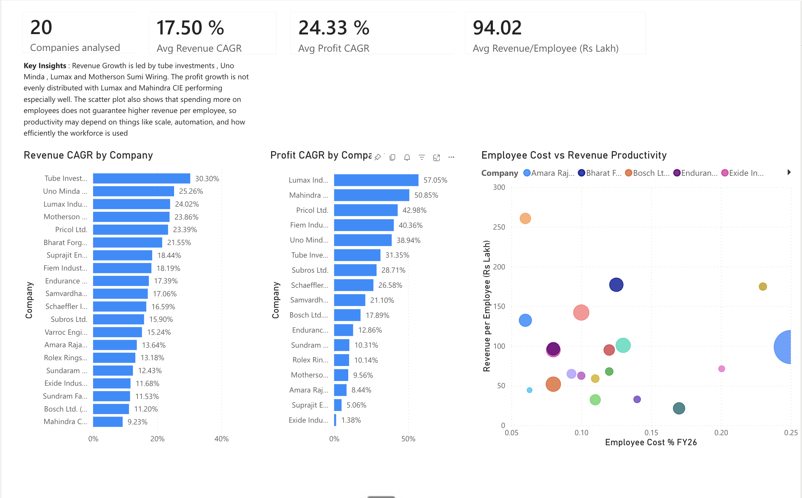
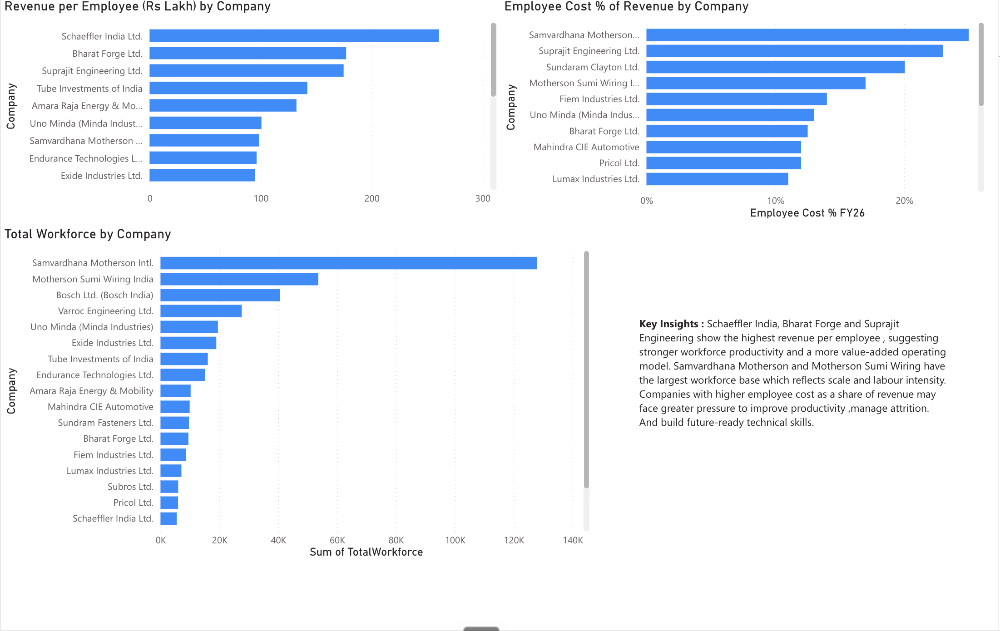

# Indian Auto Workforce Analytics

## Overview

This project analyses financial and workforce trends across 20 leading companies in the Indian auto-component sector.

The objective was to benchmark company growth and workforce productivity while also examining the talent and skill challenges emerging from India's transition toward electric vehicles.

## Dashboard Preview

### Financial Overview

### Workforce Productivity

## What I Analysed

- Revenue CAGR
- Profit CAGR
- Employee cost trends
- Revenue per employee
- Total workforce
- Workforce productivity
- EV-related skill gaps

## Tools Used

- Power BI
- Microsoft Excel
- Financial benchmarking
- Workforce analytics
- Industry research

## Dashboard Highlights

- **20 companies analysed**
- **Average Revenue CAGR:** 17.50%
- **Average Profit CAGR:** 24.33%
- **Average Revenue per Employee:** ₹94.02 lakh

## Key Insights

- Tube Investments, Uno Minda, Lumax Industries and Motherson Sumi Wiring were among the strongest companies by revenue growth.
- Profit growth varied considerably across the peer group, with Lumax Industries and Mahindra CIE among the strongest performers.
- Higher employee expenditure did not consistently correspond with higher revenue per employee, indicating differences in scale, automation and workforce utilisation.
- Schaeffler India, Bharat Forge and Suprajit Engineering were among the strongest performers on revenue per employee.
- Samvardhana Motherson and Motherson Sumi Wiring operated with some of the largest workforce bases in the peer group.

## EV Workforce Analysis

The project also examined how the shift toward electric vehicles is changing workforce requirements in India's automotive sector.

Research focused on emerging skill gaps and future technical capability requirements using publicly available information from sources including:

- NSDC
- ACMA
- SIAM
- Company annual reports

## Project Context

This analysis was developed during my experience with the **People Consulting – Workforce Advisory team at EY India**.

All data contained in this repository was obtained from publicly available company and industry sources. No confidential client or internal EY data is included.

## Project Files

- [`auto-workforce-dashboard.pbix`](auto-workforce-dashboard.pbix) – Power BI dashboard
- [`auto-workforce-dashboard.pdf`](auto-workforce-dashboard.pdf) – PDF dashboard export
- [`indian-auto-workforce-benchmarking.xlsx`](indian-auto-workforce-benchmarking.xlsx) – Financial and workforce benchmarking workbook
